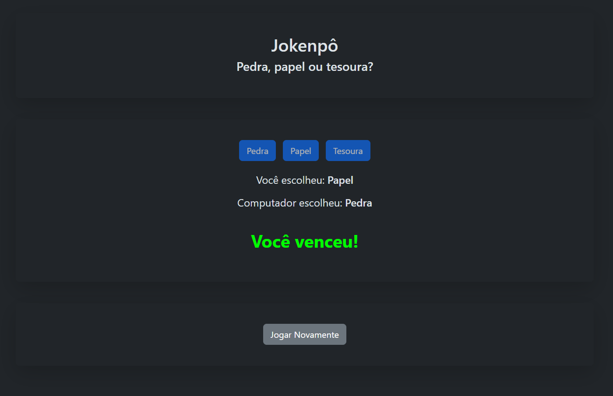

# Rock Paper Scissors
#### The name is just a brazilified version of "jankenpon"
Project was made to practice DOM interaction, browser events and primarily animating UI.
There's no live version of the website so to try it out you'll need to:
1. Clone the repo yourself, either by:
   1. `git clone https://github.com/Kaestee/jokenpo.git`
   2. or by clicking `<> Code` > `Download ZIP` and extracting the file
2. Opening the `index.html` file in the folder

> [!WARNING]
> All text is in currently only in portuguese!

## Preview

